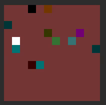

# gym-explore
RL hard exploration environments 


**random agent run**


**agent state is only current room**, image 3x96x96




goal is to explore all rooms

agent sees only current room, can move in 4 directions

environments can runs **thousands of FPS**, not depending on rooms count

parameters
- observation : RGB image, shape 3x96x96
- actions     : 4 movement actions + 1 no move
- reward      : +1 when all rooms visited, -1 when max_episode_steps

episode steps (room is 12x12 fields)
- max_episode_steps = size*size*room_size*4
- room_size = 12


# install

**dependencec** python3, pip3, numpy, gym, PIL, cv2

```bash
cd gym-explore
pip3 install -e .
```

# usage

random agent example

```python
import gym
import gym_explore
import numpy
import time

#create 8x8 rooms
env     = gym.make("ExploreArcadeGeneric-v0", size=8)
state   = env.reset()

actions_count  = env.action_space.n

k   = 0.02
fps = 0.0

action = 0
while True:

    if numpy.random.randint(100) < 20:
        action = numpy.random.randint(actions_count)
        
    time_start = time.time()
    state, reward, done, _ = env.step(action)
    time_stop  = time.time()

    env.render(True)
    time.sleep(0.01)

    fps = (1.0 - k)*fps + k*1.0/(time_stop - time_start + 0.00001)
    print("fps = ", round(fps, 2))
```